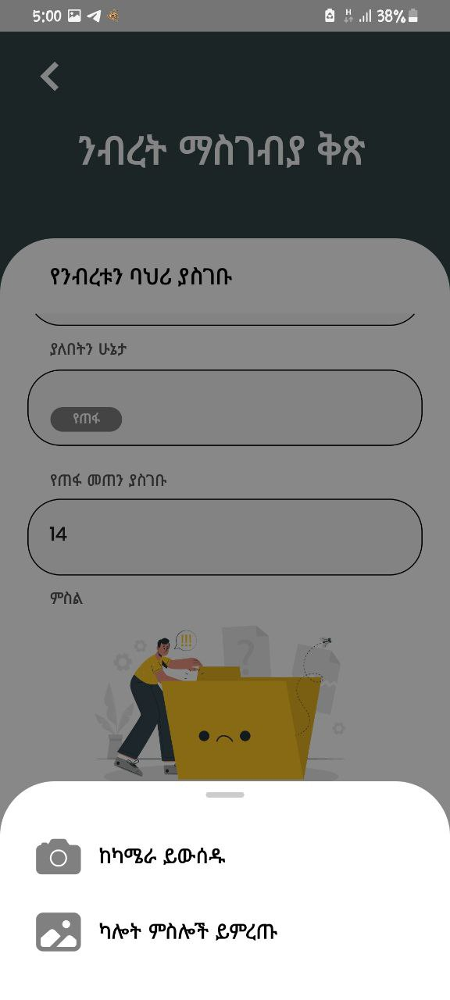

## Screenshots

&nbsp;

- Here I have included screenshots of the application. Note that the image translations was performed using Google Lens, and while I can verify that some translations are inaccurate, they are actually coherent in the Amharic language that the application is currently being used, particularly accurate in my church's context.
&nbsp;

  
  

&nbsp;

  
  

&nbsp;

  
  

&nbsp;

  
  

&nbsp;

  
  

